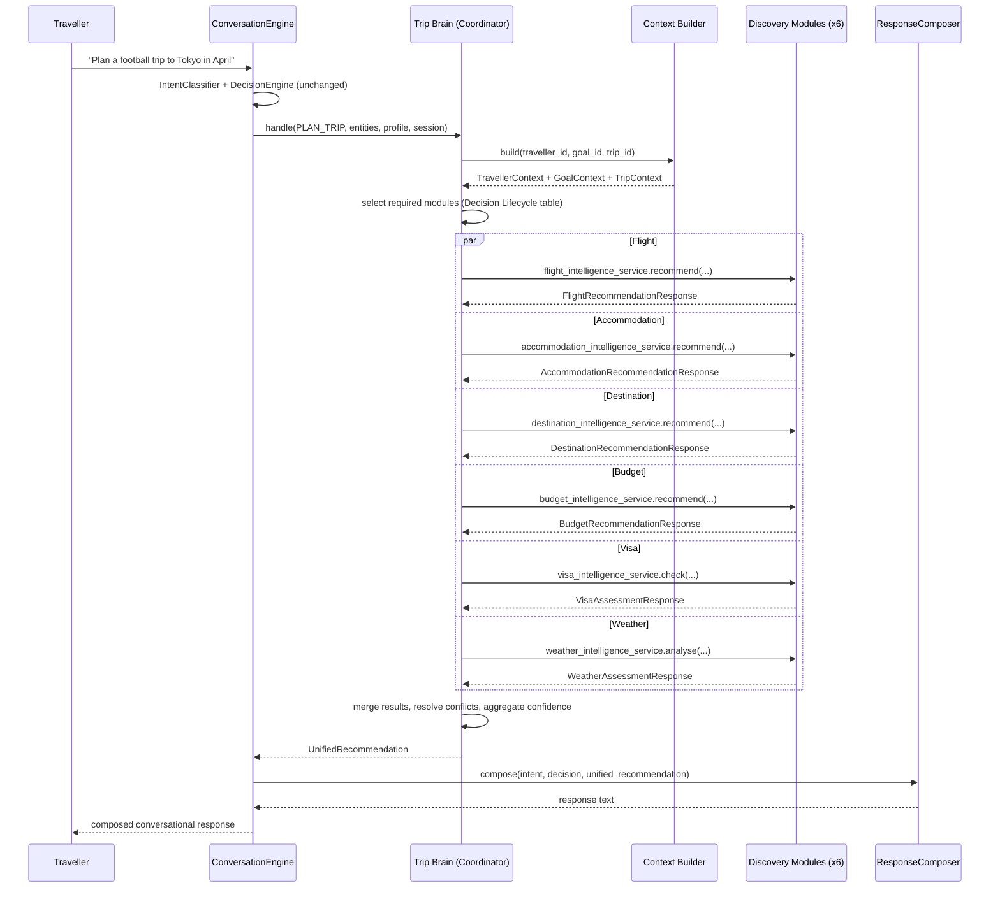
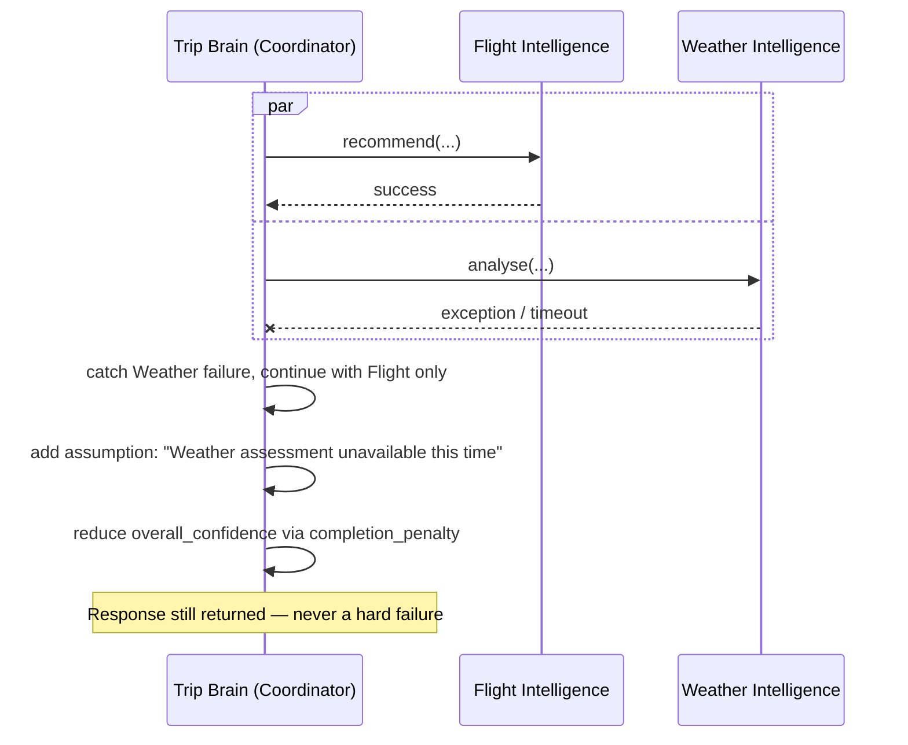

# Trip Brain Architecture

T-021 — architecture only, no implementation. Defines how the Trip Brain orchestrates the six Discovery Layer modules (Flight, Accommodation, Destination, Budget, Visa, Weather & Safety Intelligence) so the traveller only ever talks to one AI: **Tralvana Travel**.

## Why This Document Exists

Every Discovery module built so far (T-015–T-020) is invoked one at a time: a traveller message classifies to exactly one `Intent`, and `ConversationEngine` routes it to exactly one Discovery module's service (`_get_flight_recommendations`, `_get_weather_assessment`, etc.). This works for a single, narrow question ("recommend flights to Tokyo") but not for what a travel concierge actually needs to do: answer "help me plan a football trip to Tokyo in April" by drawing on *all six* modules at once, reconciling their outputs, and replying with one coherent recommendation — not six separate answers stitched together by the traveller themselves.

There is also a second, more concrete problem this document surfaces: **`PLAN_TRIP` — the intent a broad planning request actually classifies to — does not call any of the six real Discovery modules today.** It still calls the Sprint-1 placeholder specialist agents (`flight_agent`, `hotel_agent`, `budget_agent`, `experience_agent`, `visa_agent` via `ai/manager/TravelManager` + `ai/registry/AgentRegistry`), which return static "pending_live_data" stubs. The six real modules are only reachable through their own narrow, single-purpose intents (`FLIGHT_SEARCH`, `ACCOMMODATION_SEARCH`, etc.). Trip Brain's primary job is to close this gap — see "Relationship to Existing Orchestration" below.

## Responsibilities

Trip Brain is responsible for:

1. **Determining which Discovery modules a request actually needs** — not every request needs all six (a bare "recommend flights to Tokyo" still only needs Flight Intelligence; "help me plan a trip to Tokyo in April" needs most or all of them).
2. **Building the shared context** (Traveller, Goal, Trip) every module it calls will need, once, rather than each module independently re-deriving it.
3. **Running the required modules** and collecting their results, tolerating partial failure.
4. **Merging results into one unified recommendation** — reconciling overlapping or conflicting signals (e.g. Budget Intelligence says "backpacker tier" while Accommodation Intelligence's top pick is a 4-star hotel).
5. **Propagating and aggregating confidence** into one number the traveller-facing response can quote.
6. **Preserving explainability** — every module's own `explanation`/`reasoning` text survives into the final response, attributable to its source, never paraphrased away.
7. **Composing one conversational response** via the existing `ResponseComposer`, extended (not replaced) to handle multiple simultaneous module results.

Trip Brain is **not** responsible for: scoring, ranking, or reasoning about any individual domain (destinations, flights, budget, ...) — that stays entirely inside the Discovery Layer, unchanged. Trip Brain is an orchestration layer, not a seventh intelligence engine.

## Relationship to Existing Orchestration

The repository currently has two parallel, disconnected orchestration paths. Trip Brain unifies them into one.

| | Track A — Specialist Agents (Sprint 1) | Track B — Discovery Layer (T-015–T-020) |
|---|---|---|
| Entry point | `Intent.PLAN_TRIP` | `Intent.FLIGHT_SEARCH`, `ACCOMMODATION_SEARCH`, `DESTINATION_DISCOVERY`, `BUDGET_ANALYSIS`, `VISA_CHECK`, `WEATHER_ANALYSIS` |
| Dispatcher | `ai/manager/TravelManager` + `ai/registry/AgentRegistry` | `ConversationEngine._get_<domain>_*()` private methods, one per module |
| Workers | `ai/agents/{flight,hotel,budget,experience,visa}_agent.py` — static placeholder output, "Sprint 5 activates live data" | `ai/discovery/<domain>/<domain>_intelligence.py` — real, deterministic, explainable scoring |
| Output shape | One `AgentResult` per agent, generic `data` dict | One rich, domain-specific result per module (ranked options or a single assessment) |

Trip Brain's core architectural move: **`PLAN_TRIP` (and any future broad-planning intent) routes through Trip Brain, which calls the six real Discovery module services instead of the five placeholder agents.** `TravelManager`/`AgentRegistry` is not deleted by this document (no code changes here at all). Implementation is deliberately split across two later tasks: **T-022** builds Trip Brain and repoints `PLAN_TRIP` at it, but leaves Track A's code (`ai/manager/`, `ai/registry/`, the five placeholder agents) in place, uncalled, as a rollback path; **T-023**, a distinct task started only after T-022 is fully implemented and verified, removes that dormant code. Track B's per-domain intents (`FLIGHT_SEARCH` etc.) are untouched throughout; a traveller can still ask a narrow single-domain question and get a fast, single-module answer without invoking the full Trip Brain pipeline.

## Orchestration Lifecycle

```
Input
  │
  ▼
Intent (IntentClassifier + DecisionEngine — unchanged, reused)
  │
  ▼
Traveller Context (ai/memory/traveller_intelligence_service — unchanged, reused)
  │
  ▼
Goal Context (services/api/app/domains/goals/service — unchanged, reused)
  │
  ▼
Trip Context (services/api/app/domains/trips/service — unchanged, reused)
  │
  ▼
Determine Required Intelligence Modules  ◄── NEW: Trip Brain's module-selection logic
  │
  ▼
Run Required Modules (parallel, via each module's existing service.recommend()/check()/analyse())
  │
  ▼
Merge Results        ◄── NEW
  │
  ▼
Resolve Conflicts    ◄── NEW
  │
  ▼
Confidence Calculation ◄── NEW
  │
  ▼
Unified Recommendation ◄── NEW
  │
  ▼
Explainability (preserve each module's explanation, add one synthesis sentence) ◄── NEW
  │
  ▼
Conversation Response (ResponseComposer — reused, extended)
```

Every stage before "Determine Required Intelligence Modules" already exists in the codebase today and requires no new code — Trip Brain's actual surface area is the five middle stages.

## Request Lifecycle

What happens, end to end, for one traveller message:

1. `POST /conversation/message` receives the raw text (unchanged — no new endpoint).
2. `ConversationEngine` restores or creates the session, as today.
3. `IntentClassifier.classify()` runs, as today, producing `Intent` + extracted entities.
4. `DecisionEngine.decide()` runs, as today, producing `has_enough_information`, `follow_up_questions`, `is_safety_sensitive`.
5. If information is missing, the existing clarification path fires unchanged — Trip Brain is never invoked for an incomplete request, exactly like every Discovery module today.
6. If the intent is a **narrow, single-domain intent** (`FLIGHT_SEARCH`, `ACCOMMODATION_SEARCH`, `DESTINATION_DISCOVERY`, `BUDGET_ANALYSIS`, `VISA_CHECK`, `WEATHER_ANALYSIS`), `ConversationEngine` continues to call that one module directly, exactly as it does today — Trip Brain adds nothing here, and nothing regresses.
7. If the intent is **broad** (`PLAN_TRIP`, or a future `TRIP_BRAIN` catch-all — see ADR-017), `ConversationEngine` hands off to Trip Brain instead of `TravelManager`.
8. Trip Brain builds context, selects modules, runs them, merges, resolves conflicts, computes confidence, and returns one `UnifiedRecommendation`.
9. `ResponseComposer` composes the traveller-facing text from the `UnifiedRecommendation`, the same place it already composes text from a single `AgentResult` today.
10. The session is updated and persisted, as today.

## Decision Lifecycle — "Determine Required Intelligence Modules"

This is the one genuinely new decision Trip Brain introduces. It is a **static, explainable mapping**, not a model — consistent with every other decision point in this codebase (`IntentClassifier`, `DecisionEngine`, and every Discovery module's labelling algorithm are all deterministic rule-based logic, not ML).

| Signal present in Traveller/Goal/Trip Context | Modules selected |
|---|---|
| Destination known, no dates | Destination Intelligence, Weather Intelligence (best-month mode) |
| Destination + dates known | + Flight Intelligence, Accommodation Intelligence, Weather Intelligence (specific month) |
| Goal has a `budget` cap | + Budget Intelligence |
| Traveller nationality differs from destination country (or is unknown) | + Visa Intelligence |
| `PLAN_TRIP` with full trip shape (destination, dates, party size) | All six |

This table is the entire "intelligence" of module selection — no scoring, no ranking, nothing that belongs in a Discovery module. It reads signals that already exist on the Goal/Trip/Traveller objects (`Goal.budget`, `Goal.timeframe`, `TripPlan.destination`, `TravellerProfile.identity.nationality`) — no new fields anywhere.

## Memory Usage

Trip Brain introduces **no new memory store**. It reads and writes exactly the two memory surfaces that already exist:

- **Long-term / cross-session**: `ai/memory/traveller_intelligence_service.py` — the traveller's profile, preferences, and inferred DNA (`ai/intelligence/traveller_dna/`). Read-only from Trip Brain's perspective; Trip Brain never writes traveller preferences directly (that stays `UPDATE_PREFERENCES`'s job).
- **Short-term / per-conversation**: `ConversationSession` (`ai/concierge/conversation_engine.py`) — `history`, `goal_id`, `trip_id`, `pending_questions`. Trip Brain reads `session.goal_id`/`session.trip_id` to build Goal/Trip Context, and — like the existing `PLAN_TRIP` path already does — may cause a Goal or Trip to be created if none exists yet, writing back through the existing `goal_service`/`trip_planning_service`, not a new write path.

One new *within-request* concept is needed, not a new persistent store: a **working context object** passed to every module Trip Brain calls in a single orchestration pass, so five modules don't each independently re-fetch the same traveller profile. This is scoped to a single `analyse()`/`plan()` call and discarded afterward — see "Recommended Folder Structure" in the companion review for where this would live (`context_builder.py`) if built.

## Session Management

Unchanged. `ConversationSession` already carries everything Trip Brain needs (`traveller_id`, `trip_id`, `goal_id`, `conversation_id`). Trip Brain does not need its own session concept — it is a stateless orchestration pass invoked once per qualifying message, exactly like every Discovery module's service call today. Multi-turn refinement ("actually, make it cheaper") is handled the same way it is today: a new message, a new classification, and — if the intent stays broad — another Trip Brain pass, now with `session.trip_id` already set so Trip Context carries forward.

## Failure Handling

Every existing `ConversationEngine._get_<domain>_*()` method already follows the same defensive pattern:

```python
try:
    output = <domain>_service.recommend_from_conversation(...)
except Exception:
    return None
```

Trip Brain formalizes this into an explicit policy rather than an implicit per-call side effect:

1. **Per-module isolation.** Each of the (up to six) module calls is wrapped independently. One module raising or timing out does not abort the others — they run to completion regardless (see the sequence diagram below).
2. **Graceful degradation, not failure.** If Weather Intelligence fails but Flight and Accommodation succeed, Trip Brain returns a `UnifiedRecommendation` built from the two that succeeded, with an `assumptions` entry stating plainly that the weather assessment could not be produced — the same honesty convention every Discovery module already uses for missing input ("No traveller profile linked...", "No goal budget cap supplied...").
3. **Total failure floor.** If *zero* modules succeed, Trip Brain returns a result equivalent to today's `AgentStatus.NEEDS_INFORMATION` / empty-results path — `ResponseComposer` already has a fallback branch for "no results" (`"I'll bring in live data for flights, hotels, and pricing in a future sprint..."`) that this reuses without modification.
4. **No silent retries, no cross-module fallback substitution.** If Visa Intelligence fails, Trip Brain does not attempt to answer the visa question from another module — it omits that section and says so. Inventing an answer from the wrong source would violate the "not legal advice" / "not a forecast" disclaimers every affected module already carries.

## Confidence Propagation

Every module already produces a confidence-bearing signal today, even though the field name and derivation differ slightly per module:

- Budget, Visa, and Weather Intelligence return an explicit `confidence` field per assessment.
- Flight, Accommodation, and Destination Intelligence don't have a top-level `confidence` field on the domain model, but every existing `ConversationEngine._get_<domain>_recommendations()` method already computes one as the mean `match_score` across returned options (e.g. `avg_confidence = sum(f["match_score"] for f in options) / len(options)`) before wrapping it into an `AgentResult.confidence`.

Trip Brain's confidence calculation is therefore a **second-order aggregation over values that already exist**, not a new scoring model:

```
overall_confidence = weighted_average(per_module_confidence, weight=module_relevance)
                      × completion_penalty
```

- `module_relevance` — how central that module was to the request (a module selected because it was directly asked about weighs more than one pulled in as supporting context — reuses the same selection table from the Decision Lifecycle).
- `completion_penalty` — reduces overall confidence proportionally to how many selected modules failed (per Failure Handling above); a fully-succeeded 3-module request is not penalized, a 2-of-3-succeeded request is.

This mirrors exactly how every individual Discovery module already computes its own confidence from a weighted sum of sub-dimensions (`SCORE_WEIGHTS` in every `*_scorer.py`) — Trip Brain applies the identical pattern one level up, module-confidence instead of dimension-score.

## Explainability Strategy

Grounded directly in the product's own stated commitment: *"Transparent — AI decisions are explainable. The system shows why it made a recommendation, not just what it recommends"* (`docs/00-product-constitution.md`), and the Discovery Layer's existing mechanism for it — every Reasoner's `explain()` produces one traceable, sentence-by-sentence explanation from its own Scorer's `breakdown` (`docs/DISCOVERY_LAYER_PATTERN.md`).

Trip Brain's rule: **never regenerate or summarize away a module's own explanation.** The unified response is a composition, not a rewrite:

1. Each module's `explanation`/`reasoning` text is preserved verbatim, attributed to its module (the existing `ResponseComposer._section_for()` pattern of one labelled section per `AgentResult` — `**Flights:** ...`, `**Weather:** ...` — already does exactly this for single-module responses and extends unchanged to multiple).
2. Trip Brain adds exactly **one** synthesis sentence at the top, connecting the sections (e.g. "Here's what I found for your April Tokyo trip: flights, accommodation, weather, and an entry-requirements check."). This sentence names *what was checked*, never *why* — the why stays inside each module's own attributed section.
3. Every assumption and risk from every module is preserved and surfaced, not deduplicated into a lossy summary — `ResponseComposer` and `_build_output()` already concatenate `assumptions`/`risks`/`next_actions` across multiple `AgentResult`s (`all_assumptions.extend(r.assumptions)` etc.) — this is already multi-module-ready and needs no change.

## Failure Scenarios

| Scenario | Behaviour |
|---|---|
| Traveller asks a narrow question ("recommend flights to Tokyo") | Track B path, unchanged — Trip Brain never invoked |
| Traveller asks a broad question, one module (Weather) errors | 5-of-6 results composed; explicit assumption naming the gap |
| Traveller asks a broad question, all modules error | Existing "no results" fallback response, unchanged |
| Destination unknown to any module (e.g. a city outside every mock catalogue) | Each module already handles this itself (`CHECK_MANUALLY`, low confidence, "not in the mock catalogue" assumptions) — Trip Brain propagates these unmodified, does not paper over them |
| Two modules disagree (Budget says "backpacker", Accommodation's top pick is 4-star) | Conflict Resolution stage flags the mismatch explicitly rather than silently picking one — see `docs/ORCHESTRATION_PATTERN.md`'s Coordinator section |
| Traveller's profile is missing entirely | Every module already has its own "no profile" assumption; Trip Brain's synthesis sentence adds nothing extra here — no new "missing profile" handling needed |

## Sequence Diagram — Broad Request, All Modules Succeed



## Sequence Diagram — Partial Failure



## Component Diagram

```mermaid
graph TD
    subgraph Conversation Layer - unchanged
        IC[IntentClassifier]
        DE[DecisionEngine]
        CE[ConversationEngine]
        RC[ResponseComposer]
    end

    subgraph Trip Brain - NEW, orchestration only
        TB[TripBrain - Coordinator]
        CTXB[ContextBuilder]
        SEL[Module Selection]
        MERGE[Result Merge + Conflict Resolution]
        CONF[Confidence Aggregation]
    end

    subgraph Context Sources - unchanged
        MEM[ai/memory - Traveller Context]
        GOAL[Goals domain - Goal Context]
        TRIP[Trips domain - Trip Context]
    end

    subgraph Discovery Layer - unchanged
        FL[Flight Intelligence]
        AC[Accommodation Intelligence]
        DS[Destination Intelligence]
        BG[Budget Intelligence]
        VS[Visa Intelligence]
        WX[Weather Intelligence]
    end

    subgraph Knowledge Sources - unchanged
        KG[ai/intelligence - Knowledge Graph, Ontology, Reasoning]
        DNA[Traveller DNA]
    end

    CE --> IC --> DE --> CE
    CE -->|narrow intent| FL
    CE -->|narrow intent| AC
    CE -->|narrow intent| DS
    CE -->|narrow intent| BG
    CE -->|narrow intent| VS
    CE -->|narrow intent| WX
    CE -->|broad intent: PLAN_TRIP| TB
    TB --> CTXB
    CTXB --> MEM
    CTXB --> GOAL
    CTXB --> TRIP
    TB --> SEL
    SEL --> FL
    SEL --> AC
    SEL --> DS
    SEL --> BG
    SEL --> VS
    SEL --> WX
    FL --> KG
    AC --> KG
    DS --> KG
    DNA -.-> FL
    DNA -.-> AC
    DNA -.-> DS
    DNA -.-> BG
    DNA -.-> WX
    FL --> MERGE
    AC --> MERGE
    DS --> MERGE
    BG --> MERGE
    VS --> MERGE
    WX --> MERGE
    MERGE --> CONF
    CONF --> TB
    TB --> CE
    CE --> RC --> CE
```

## Example Conversations

**Narrow request — Trip Brain not invoked (unchanged today):**

> **Traveller:** "Recommend flights to Tokyo."
> **System:** `Intent.FLIGHT_SEARCH` → `ConversationEngine._get_flight_recommendations()` → Flight Intelligence directly. Trip Brain plays no role.

**Broad request — full orchestration:**

> **Traveller:** "I want to plan a football trip to Tokyo in April, budget around $3000."
> **System:** `Intent.PLAN_TRIP` → Trip Brain builds context (destination=Tokyo, month=4, goal_type=FOOTBALL_TRAVEL, budget.max_usd=3000) → selects all six modules → runs them in parallel → merges: Destination Intelligence surfaces football-relevant Tokyo neighbourhoods, Weather Intelligence confirms April is a good month, Budget Intelligence flags that a "comfort" tier trip fits the $3000 cap while "luxury" doesn't, Flight and Accommodation Intelligence return ranked options within that budget, Visa Intelligence checks the traveller's passport against Japan → one composed response citing all six, one overall confidence, one recommendation.

**Partial failure:**

> **Traveller:** "Plan a trip to Lagos for December."
> **System:** Five modules succeed; Weather Intelligence's mock catalogue doesn't cover a destination the traveller meant informally — say the destination string didn't resolve — Trip Brain still returns flight, accommodation, budget, and visa results, with an assumption: "Weather and safety data wasn't available for this destination — check conditions closer to your travel date."

## Implementation Notes (T-022)

Implemented exactly as this document specifies. Where the architecture
left a parameter unspecified, the concrete choice made is recorded here.

**Package layout** — `ai/trip_brain/`: `context.py` (`ContextBuilder`/
`TripBrainContext`), `module_selection.py` (`ModuleSelector`),
`discovery_adapters.py` (the six, and only six, call sites into the
Discovery modules), `confidence.py`, `conflicts.py`, `synthesis.py`,
`models.py` (`UnifiedRecommendation`), `coordinator.py` (`TripBrain`).

**Module relevance weights** — the Decision Lifecycle table doesn't
assign numbers, only "central" vs. "supporting context". Implemented as
two constants: `CORE_WEIGHT = 1.0` for Destination and Weather (always,
once a destination is known) and Flight/Accommodation (once dates are
also known); `SUPPORTING_WEIGHT = 0.7` for Budget (only added because a
Goal carries a budget cap) and Visa (only added because nationality is
unknown or differs from the destination). The "full trip shape → all
six" row is implemented as an override: when destination, dates, and
party size are all known, every module's weight is set to `CORE_WEIGHT`
regardless of whether the Budget/Visa-specific triggers independently
fired — a literal reading of that row as its own unconditional case, not
a refinement of the other four rows.

**"Party size known"** is true whenever a Goal's or Trip's `travellers`
object has an `adults` count set — which is always true once a Goal
exists, since `GoalService.create_from_conversation()` defaults
`travellers.adults` to 1. In practice this means a `PLAN_TRIP` request
with both a destination and any date signal reaches the "full trip
shape" case and gets all six modules, matching the worked example in
this document's "Example Conversations" section.

**Confidence aggregation** matches the documented formula exactly:
`weighted_average(per_module_confidence, weight=module_relevance) ×
completion_penalty`, where the weighted average is taken only over
*succeeded* modules (a failed module's 0.0 confidence never drags the
average down — that's `completion_penalty`'s job, computed as
`len(succeeded) / len(selected)`).

**Conflict Resolution** implements exactly the one worked example in
`docs/ORCHESTRATION_PATTERN.md` (Budget's `BEST_OVERALL` tier vs.
Accommodation's `BEST_OVERALL` star rating) as a presentation-only
assumption appended to the Accommodation result — no other conflict
rules exist yet; extending this table is future work, not required for
T-022.

**`ResponseComposer` extension** — two additive changes only:
1. An optional `synthesis_note` parameter to `compose()`, used in place
   of the per-intent preamble when provided. Every existing caller
   (all six narrow intents, plus any future caller that doesn't pass it)
   is unaffected — `None` is the default and preserves prior behaviour
   exactly.
2. The "no results" fallback condition changed from `if not results:` to
   `if not any(r.status != FAILED for r in results):` — the Total
   Failure Floor. Backward-compatible: no pre-existing caller ever
   produced an all-`FAILED` non-empty `results` list before Trip Brain
   existed (the six narrow-intent private methods return `None`,
   filtered out entirely, rather than a `FAILED` `AgentResult`), so this
   is a strict behavioural improvement with no regression surface.

**Bug found and fixed along the way** — `IntentClassifier._extract_entities`'s
destination marker search took the *first* occurrence of `" to "` in the
message, which collides with auxiliary "want to <verb>" / "need to
<verb>" constructions ("I want to travel to Tokyo" → destination
misread as "Travel"). Fixed by having the `"to "` marker keep scanning
past known infinitive-verb candidates (`want`, `need`, `travel`, `fly`,
`plan`, ...) for the real prepositional "to". This is the same class of
shared-code bug T-020 already found and fixed twice in this method; it
directly affects Trip Brain's primary entry point (`PLAN_TRIP`'s most
natural phrasing), so it was fixed rather than worked around.

## Non-Goals (Explicitly Out of Scope for Trip Brain)

- Trip Brain does not book anything (Commerce is Phase 6, per `docs/ROADMAP.md`).
- Trip Brain does not learn or adapt scoring weights — that stays inside each Discovery module's deterministic Scorer, unchanged.
- Trip Brain does not introduce a vector store, embeddings, or RAG — that is Phase 5's separate, larger initiative (see `docs/EPIC3_ARCHITECTURE.md`).
- Trip Brain does not replace `ai/planning/trip_planner.py`'s itinerary assembly — it *feeds* it real Discovery Layer data instead of static estimates (see `docs/ORCHESTRATION_PATTERN.md`).
